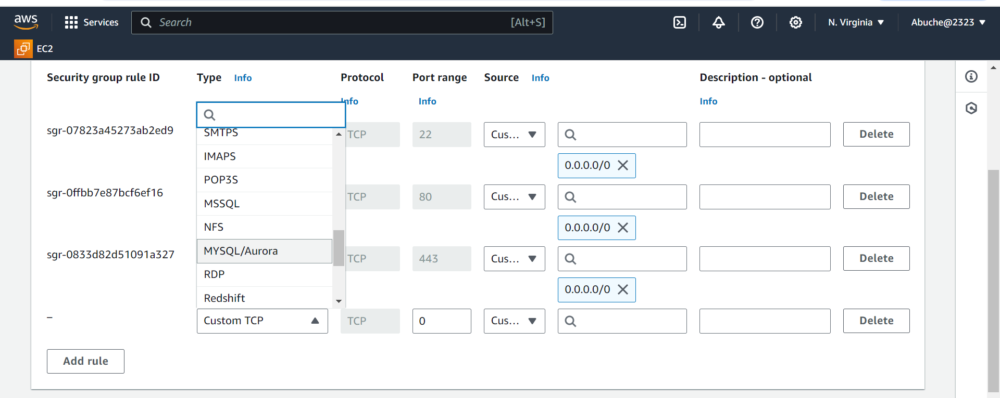

 # How to Setup WordPress Website Using LAMP Stack

 Setting up a WordPress website using the LAMP stack (Linux, Apache, MySQL, PHP) is a powerful way to create a robust and scalable web presence. This project will guide you through each step of the process, from setting up your server environment to installing WordPress and configuring it for optimal performance. Whether you're a seasoned developer or a beginner, this tutorial will provide you with the knowledge and skills needed to deploy a fully functional WordPress site. By the end of this guide, you'll have a solid understanding of how to leverage the LAMP stack to build and manage your own WordPress website, ensuring a secure, efficient, and customizable platform for your content.

## Key Features:

Step-by-step instructions for installing and configuring LAMP components.
Secure database creation for your WordPress website.
User-friendly guide for completing the WordPress installation process.

## Benefits:
Gain independence by managing your own WordPress website.
Understand the core technologies behind WordPress.
Customize your website to your exact needs.
Embrace the flexibility and power of WordPress.

# Introduction
Before we begin, let's review the tools we'll be using throughout this project.

## Linux
Linux is the cornerstone of the LAMP stack, serving as the operating system that underpins the entire infrastructure. As an open-source and highly customizable platform, Linux provides a stable and secure environment for hosting web applications. Its efficiency in handling processes and resources makes it an ideal choice for web servers. In a LAMP stack, Linux coordinates the interaction between Apache (the web server), MySQL (the database), and PHP (the scripting language), ensuring seamless operation and communication between these components. This foundation allows for high performance, flexibility, and scalability, making Linux a crucial element in the successful deployment and management of a LAMP-based WordPress website.

## Apache
Apache is a critical component of the LAMP stack, acting as the web server that handles client requests and serves web content. As an open-source and widely used web server software, Apache is known for its reliability, security, and flexibility. In a LAMP stack, Apache processes incoming HTTP requests, fetching and delivering web pages to users' browsers. It also supports various modules that extend its functionality, such as URL redirection, authentication, and load balancing. By efficiently managing web traffic and providing a stable platform for running web applications, Apache ensures that your WordPress website runs smoothly and can handle a large number of concurrent users.

## MySQL
MySQL is the database management system within the LAMP stack, responsible for storing and managing the data that powers your web applications. As an open-source relational database, MySQL offers robust performance, scalability, and security. In the context of a LAMP stack, MySQL works closely with PHP to handle data operations such as storing user information, retrieving content, and managing transactions. For a WordPress website, MySQL stores all the content, user data, settings, and other essential information, allowing for dynamic content generation and efficient data retrieval. By ensuring data integrity and providing powerful querying capabilities, MySQL plays a crucial role in maintaining the functionality and performance of a WordPress site on the LAMP stack.

## PHP
PHP is the scripting language in the LAMP stack, responsible for generating dynamic web content. As a server-side language, PHP processes code on the web server to create HTML content that is then sent to the user's browser. In the LAMP stack, PHP works in tandem with Apache to handle web requests and interact with the MySQL database to retrieve and manipulate data. For a WordPress website, PHP executes the core logic that powers the site, managing everything from user authentication to content management and plugin functionality. By seamlessly integrating with Apache and MySQL, PHP ensures that your WordPress site is dynamic, interactive, and capable of delivering a rich user experience.

## Project 4
S/N	Project Tasks
1	Deploy an Ubuntu Server
2	Set up your LAMP stack on the server
3	Configure the wordpress Application
4	Map the IP address to the DNS A record
5	Validate the WordPress website setup by accessing the web address.

## Key Concepts Covered
AWS (EC2 and Route 53)
Linux(Ubuntu)
Apache
MySQL
PHP
Wordpress
DNS
SSL (certbot)
OpenSSL command

## Checklist
 Task 1: Deploy an Ubuntu Server
 Task 2: Set up your LAMP stack on the server
 Task 3: Configure the wordpress Application
 Task 4: Map the IP address to the DNS A record
 Task 5: Validate the WordPress website setup by accessing the web address.

 # Documentation
Ubuntu server was spinned up taking reference from project 1

setting up inbound rule for MYSQL in the security group. Click on Security and select the Security group. 

Click on Edit inbound rules to add rule

I Clicked on Custom TCP to select MySQL/Aurora!

IP address was added to allow access and restrict it to MySQL exclusively to the Web Server’s IP address. (inbound Rule configuration, specify the source as /32) then click Save rules

Connected to your Ubuntu server via SSH using terminal

## Installation of Apache
To install Apache, the following commands was used in your terminal.
sudo apt update

sudo apt install apache2

To enable Apache to start on boot, execute sudo systemctl enable apache2, and then verify its status with the sudo systemctl status apache2 command.

let's check if our server is running and accessible both locally and from the Internet by executing the following command: curl http://localhost:80.

.png)

Copy your public IPv4 address from your EC2 dashboard, to test how our Apache HTTP server responds to requests from the Internet.

Start the interactive script by running: sudo mysql_secure_installation. Answer y for yes, or any other key to continue without enabling specific options.

Copy your public IPv4 address from your EC2 dashboard.

## Install MYSQL
To install this software using 'apt', run the command sudo apt install mysql-server. When prompted, confirm the installation by typing 'Y' and then pressing ENTER.

After the installation is complete, log in to the MySQL console by typing: sudo mysql

* Run the following command to set the password for the root user with the MySQL native password authentication method: ALTER USER 'root'@'localhost' IDENTIFIED WITH mysql_native_password BY 'pass';. Exit the MySQL shell when you're done by typing exit.

* Start the interactive script by running: sudo mysql_secure_installation①. Answer y② for yes, or any other key to continue without enabling specific options.

* Set your password validation policy level. setting my password validation policy level to 0 because I don't require much security, as I will be terminating all resources immediately after this project. However, on the job, it's advised to use the strongest level, which is 2.

* I Enable MySQL to start on boot by executing sudo systemctl enable mysql, and then confirm its status with the sudo systemctl status mysql command.

## Install PHP
* PHP was installed along with required extensions by running the following script: sudo apt install php-curl php-gd php-mbstring php-xml php-xmlrpc php-soap php-intl php-zip

 * Execute sudo apt install php libapache2-mod-php php-mysql

* Confirm the downloaded PHP version by running php -v.

## Creating A Virtual Host For Your Website Using Apache

* Create the directory for Projectlamp using the 'mkdir' command as follows: sudo mkdir /var/www/projectlamp and assign ownership of the directory to our current system user using: sudo chown -R $USER:$USER /var/www/projectlamp

* Create and open a new configuration file in Apache's sites-available directory using your preferred command-line editor: sudo vi /etc/apache2/sites-available/projectlamp.conf.

* Creating this will produce a new blank file. Paste the configuration text provided below into it:

<VirtualHost *:80>

ServerName projectlamp

ServerAlias www.projectlamp

ServerAdmin webmaster@localhost

DocumentRoot /var/www/projectlamp

ErrorLog ${APACHE_LOG_DIR}/error.log

CustomLog ${APACHE_LOG_DIR}/access.log combined

</VirtualHost>

* Save your changes by pressing the Esc key, then type :wq and press Enter.

* Run the ls command sudo ls /etc/apache2/sites-available① to show the new file② in the sites-available directory.

* enable the new virtual host using the a2ensite command: sudo a2ensite projectlamp.

To disable Apache's default website, use the a2dissite command. Type: sudo a2dissite 000-default

* To ensure your configuration file doesn’t contain syntax errors, run: sudo apache2ctl configtest. You should see "Syntax OK" in the output if your configuration is correct.

* Finally run: sudo systemctl reload apache2. This will reload Apache for the changes to take effect.

The new website is now active, but the web root /var/www/projectlamp is still empty. Let's create an index.html file in that location to test that the virtual host works as expected.

* To create the index.html file with the content "Hello LAMP from Jay" in the /var/www/projectlamp directory, use the following command: sudo echo 'Hello LAMP from Jay' > /var/www/projectlamp/index.html.

* open our web browser and try to access our website using the IP address:
http://<EC2-Public-IP-Address>:80

Note

* Replace <EC2-Public-IP-Address> with your actual EC2 instance's public IP address.

* Remove the index.html file by running the following command: sudo rm /var/www/projectlamp/index.html 

## Enable PHP On The Website

With the default DirectoryIndex settings on Apache, a file named index.html will always take precedence over an index.php file. To change the precedence of index files (such as index.php over index.html) in Apache, you'll need to edit the dir.conf file. Here’s how you can do it:

Edit the dir.conf file using a text editor (such as nano or vi): sudo nano /etc/apache2/mods-enabled/dir.conf

~~~
<IfModule mod_dir.c>
    DirectoryIndex index.html index.cgi index.pl index.php index.xhtml index.htm
</IfModule>
~~~

To prioritize index.php over index.html, move index.php to the beginning of the list, like this:
~~~
<IfModule mod_dir.c>
    DirectoryIndex index.php index.html index.cgi index.pl index.xhtml index.htm
</IfModule>
~~~

.png)

* Press ctrl + x① on your keyboard to save and exit.
Type y② to save the changes
When prompted to confirm the file name, simply press ENTER to save the changes with the existing file name

* Finally, reload Apache for the changes to take effect: sudo systemctl reload apache2.

* Apache will prioritize index.php over index.html when both files exist in the same directory.

* To create a new file named index.php inside your custom web root folder (/var/www/projectlamp), you can use the following command to open it in the nano text editor: nano /var/www/projectlamp/index.php.

* This will create a new file. Copy and paste the following PHP code into the new file:
~~~
<?php

phpinfo();

~~~

Once you've saved and closed the file, go back to your web browser and refresh the page. You should see something like this:

* This page provides information about your server from the perspective of PHP. It is useful for debugging and to ensure that your settings are being applied correctly.
 After verifying the relevant information about your PHP server through that page, it's recommended to remove the file you created, as it contains sensitive information about your PHP environment and your Ubuntu server. You can use the rm command to do so: sudo rm /var/www/projectlamp/index.php.

* The page can be recreate if you need to access the information again later.

## Install Wordpress
* install certbot by executing the following commands: sudo apt update sudo apt install certbot python3-certbot-apache

* Run the command sudo certbot --apache to request your SSL/TLS certificate. Follow the instructions provided by Certbot to select the domain name for which you want to enable HTTPS.

.png)

* Select your preferred language and then click on Continue to proceed.

.png)
* Enter the required information and click on Install WordPress once you have finished.

* Site Title①: Enter the name of your WordPress website. It's recommended to use your domain name for better optimization.
Username②: Choose a username for logging into WordPress.
Password③: Set a secure password to protect your WordPress account.
Your email④: Provide your email address to receive updates and notifications.
Search engine visibility⑤: You can leave this box unchecked to prevent search engines from indexing your site until it's ready.

.png)

* WordPress has been successfully installed. log in to your admin dashboard using the previously set up information by clicking the Log In button.

* Enter your username and password, then click Log In to access your WordPress admin dashboard.

.png)

Once you successfully log in, you will be greeted by the WordPress dashboard page.

.png)

## Create An A Record

* To make the website accessible via the  domain name rather than the IP address, i had to set up a DNS record. I did this by buying my domain from Namecheap and then moving hosting to AWS Route 53, where I set up an A record.

Note

* Project1  was used as reference for instructions on how to create a hosted zone.

* Point your domain's DNS records to the IP addresses of your Apache load balancer server.

* In route 53, click on Create record.

.png)

* Paste your IP address and then click on Create records to create the root domain.

.png)

* Click on Create record again, to create the record for your sub domain.

.png)

Paste your IP address, input the Record name(www) and then click on Create records.

.png)

* To update your Apache configuration file in the sites-available directory to point to your domain name, use the command: sudo nano /etc/apache2/sites-available/projectlamp.conf.

* This command opens the projectlamp.conf file in the nano text editor with superuser privileges (sudo). Within the editor, adjust the necessary details to reflect your domain name configuration.

* Ensure that the server settings in your Apache configuration point to your domain name, and that the document root accurately points to your WordPress directory. Once you've made these adjustments, save the changes and exit the editor.

<VirtualHost *:80>
    ServerName <Your root domain name>
    ServerAlias <Your sub domain name>
    ServerAdmin webmaster@<Your root domain name>

    DocumentRoot /var/www/html/wordpress

    <Directory /var/www/html/wordpress>
        Options Indexes FollowSymLinks
       # AllowOverride All
        Require all granted
    </Directory>

    ErrorLog ${APACHE_LOG_DIR}/error.log
    CustomLog ${APACHE_LOG_DIR}/access.log combined
</VirtualHost>

.png)

* The new configuration defines how Apache should handle requests for your domain, and its subdomain. With this configuration: Apache will handle requests for cloudghoul.online and www.cloudghoul.online. Files will be served from the /var/www/html/wordpress directory. Directory listings and symbolic links are allowed. The directory can be accessed by any client. Error logs will be written to /var/log/apache2/error.log. Access logs will be written to /var/log/apache2/access.log in the combined log format.

* To update your wp-config.php file with DNS settings, use the following command: sudo nano wp-config.php and add these lines to the file:

/** MY DNS SETTINGS */
define('WP_HOME', 'http://<domain name>');

define('WP_SITEURL', 'http://<domain name>');

Replace http://<domain name> with your actual domain name. Save the changes and exit the editor.

.png)

* Reload your Apache server to apply the changes with the command: sudo systemctl reload apache2, After reloading, visit your website at http://<domain name> to view your WordPress site. Replace with your actual domain name.

.png)

* I log in to the WordPress admin portal, visit http://<domain name>/wp-admin, Enter your username① and password②, then click on log In③. Replace with your actual domain name.

* My domain name is eogala1818.xyz, so i'll visit http://eogala1818.xyz/wp-admin.

* Now that your WordPress site is successfully configured using my  domain name, the next step is to secure it by requesting an SSL/TLS certificate.

.png)

# Install certbot and Request For an SSL/TLS Certificate

* install certbot by executing the following commands: sudo apt update sudo apt install certbot python3-certbot-apache

* Run the command sudo certbot --apache to request your SSL/TLS certificate. Follow the instructions provided by Certbot to select the domain name for which you want to enable HTTPS.

.png)

* You should receive a message confirming that the certificate has been successfully obtained.

.png)

.png)

* Visit your website to confirm, and you'll notice that the "not secure" warning no longer appears, indicating that your site is now secure with HTTPS.

## The End Of Project 4

